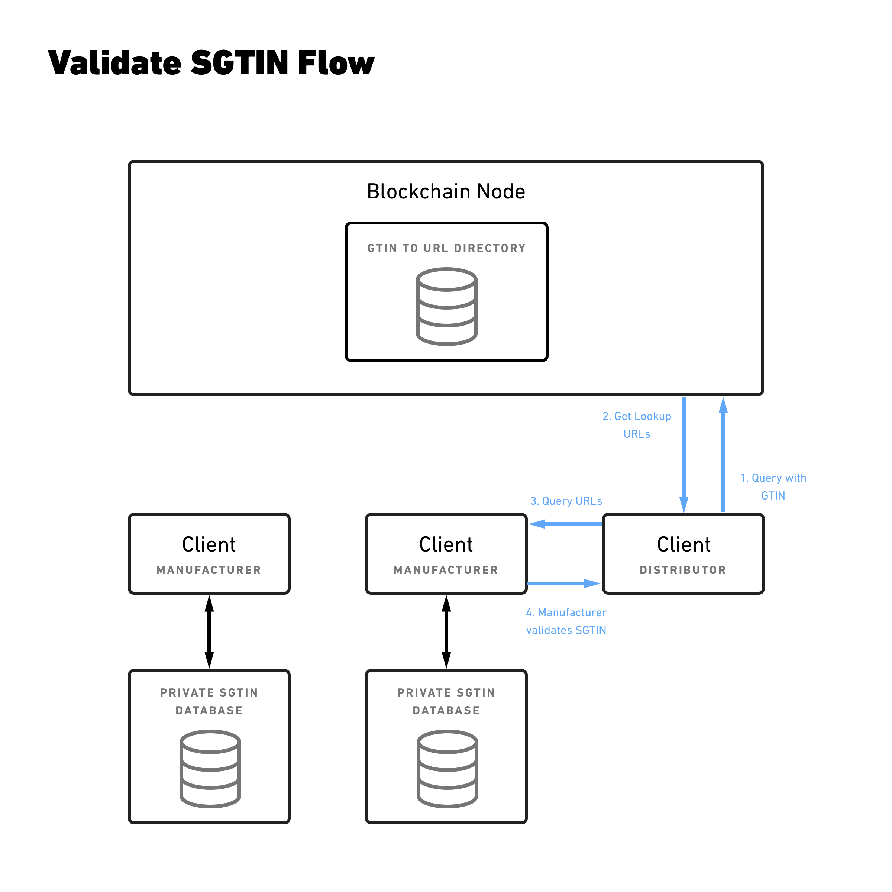

### Open source protocol for decentralized SGTIN verification and GTIN ownership transfer

A blockchain-enabled low latency solution for the pharmaceutical industry to make saleable returns compliant with the DSCSA regulations.

## Documentation
* [Overview](overview/README.md)

* [Smart contracts documentation](https://chronicled.github.io/mediledger/docs/CompanyDirectoryInterface/)

* [Smart contracts usage examples](examples/smart-contract-examples/README.md)

* [Client-to-Client communication examples](examples/client-client-examples/README.md)

## Links

* [GitHub repository](https://github.com/mediledger/saleable-returns)

* [MediLedger website](https://www.mediledger.com)

## License
Copyright (c) 2018 Chronicled Inc. All Rights Reserved
